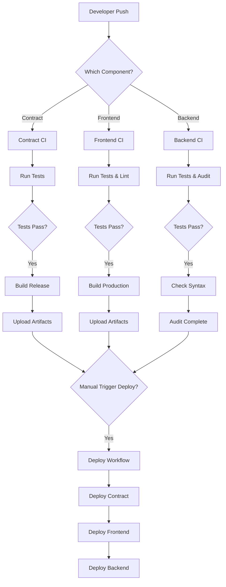

# GitHub Actions Workflows Guide

This document explains all the CI/CD workflows configured for the DotNation project.

## Overview

DotNation uses GitHub Actions for automated testing, building, and deployment across three components:
1. **Smart Contract** (ink! on Polkadot)
2. **Frontend** (React + Vite)
3. **Gemini Backend** (Node.js + Express)

## Workflows

### 1. Smart Contract CI (`contract-ci.yml`)

**Triggers:**
- Push to `main`, `master`, or `develop` branches (when contract files change)
- Pull requests to these branches

**What it does:**
- ✅ Builds contract in debug mode
- ✅ Runs unit tests
- ✅ Runs e2e tests
- ✅ Builds contract in release mode (production-ready)
- ✅ Checks WASM size (fails if > 50KB)
- ✅ Uploads contract artifacts (.contract, .json, .wasm)

**Artifacts:** Available for 30 days

---

### 2. Frontend CI (`frontend-ci.yml`)

**Triggers:**
- Push to `main`, `master`, or `develop` branches (when frontend files change)
- Pull requests to these branches

**What it does:**
- ✅ Installs dependencies with npm ci
- ✅ Runs ESLint for code quality
- ✅ Runs Vitest tests (if configured)
- ✅ Builds production bundle with Vite
- ✅ Reports bundle size
- ✅ Uploads dist/ folder as artifact

**Artifacts:** Available for 30 days

---

### 3. Gemini Backend CI (`backend-ci.yml`)

**Triggers:**
- Push to `main`, `master`, or `develop` branches (when backend files change)
- Pull requests to these branches

**What it does:**
- ✅ Installs Node.js dependencies
- ✅ Checks for syntax errors in server.js
- ✅ Runs tests (if configured)
- ✅ Runs npm audit for security vulnerabilities

---

### 4. Security Audit (`security.yml`)

**Triggers:**
- Weekly (Sunday at midnight UTC)
- Push to `main` or `master`
- Pull requests to these branches
- Manual trigger via workflow_dispatch

**What it does:**

**For Smart Contract:**
- ✅ Runs `cargo audit` to check Rust dependencies for known vulnerabilities

**For Frontend:**
- ✅ Runs `npm audit` (fails on moderate+ vulnerabilities)
- ✅ Checks for outdated packages

---

### 5. Deploy (`deploy.yml`)

**Triggers:**
- Manual only (via Actions tab)

**Input Parameters:**
- `network`: Target blockchain network (rococo, shibuya, astar)
- `environment`: Deployment environment (staging, production)

**Jobs:**

#### Job 1: Deploy Contract
- ✅ Runs all tests
- ✅ Builds release contract
- ✅ Uploads contract artifacts
- ✅ Provides manual deployment instructions

#### Job 2: Deploy Frontend
- ✅ Installs dependencies
- ✅ Runs tests
- ✅ Builds with network-specific environment variables
- ✅ Uploads production build
- ✅ Provides deployment platform instructions

#### Job 3: Deploy Backend (production only)
- ✅ Installs dependencies
- ✅ Creates .env file with secrets
- ✅ Tests server startup
- ✅ Uploads backend files (excluding node_modules)
- ✅ Provides cloud platform deployment instructions

---

## Required Secrets

Configure these in GitHub Settings → Secrets → Actions:

### Contract Deployment Secrets
- `VITE_RPC_ENDPOINT_rococo` - WebSocket endpoint for Rococo testnet
- `VITE_RPC_ENDPOINT_shibuya` - WebSocket endpoint for Shibuya testnet
- `VITE_RPC_ENDPOINT_astar` - WebSocket endpoint for Astar mainnet
- `VITE_CONTRACT_ADDRESS_rococo` - Deployed contract address on Rococo
- `VITE_CONTRACT_ADDRESS_shibuya` - Deployed contract address on Shibuya
- `VITE_CONTRACT_ADDRESS_astar` - Deployed contract address on Astar

### Backend Secrets
- `GEMINI_API_KEY` - Your Google Gemini API key

### Example Secret Values

```bash
# Rococo (testnet)
VITE_RPC_ENDPOINT_rococo=wss://rococo-contracts-rpc.polkadot.io
VITE_CONTRACT_ADDRESS_rococo=5ABC123... # After deployment

# Shibuya (testnet)
VITE_RPC_ENDPOINT_shibuya=wss://rpc.shibuya.astar.network
VITE_CONTRACT_ADDRESS_shibuya=XYZ789... # After deployment

# Astar (mainnet)
VITE_RPC_ENDPOINT_astar=wss://rpc.astar.network
VITE_CONTRACT_ADDRESS_astar=DEF456... # After deployment

# Gemini Backend
GEMINI_API_KEY=AIzaSyC... # Your actual API key
```

---

## Deployment Workflow

### Initial Setup

1. **Configure Secrets**
   - Go to GitHub repo → Settings → Secrets and variables → Actions
   - Add all required secrets listed above

2. **First Contract Deployment**
   - Go to Actions tab
   - Select "Deploy to Network"
   - Choose `network: rococo`, `environment: staging`
   - Click "Run workflow"
   - Download contract artifact from completed workflow
   - Deploy manually via Polkadot.js Apps
   - Save contract address
   - Add address to secrets as `VITE_CONTRACT_ADDRESS_rococo`

3. **Deploy Frontend**
   - After contract deployment, trigger deploy workflow again
   - Frontend job will now use the contract address
   - Download frontend artifact
   - Deploy to Vercel/Netlify:
     ```bash
     # Vercel
     vercel --prod
     
     # Netlify
     netlify deploy --prod --dir=dist
     ```

4. **Deploy Backend**
   - Set `environment: production` when running workflow
   - Download backend artifact
   - Deploy to your chosen platform:
     ```bash
     # Railway
     railway up
     
     # Render (using render.yaml)
     render deploy
     
     # Fly.io
     fly deploy
     ```

---

## Continuous Deployment Pattern



---

## Testing Locally Before Push

### Smart Contract
```bash
cd donation_platform
cargo test
cargo test --features e2e-tests
cargo contract build --release
```

### Frontend
```bash
cd frontend
npm run lint
npm test -- --run
npm run build
```

### Backend
```bash
cd gemini-backend
node -c server.js  # Syntax check
npm audit
node server.js     # Manual test
```

---

## Troubleshooting

### Contract CI Fails on Size Check
- Contract WASM is > 50KB
- Solution: Optimize code, remove unused dependencies, use `#[ink(storage)]` efficiently

### Frontend Build Fails
- Check ESLint errors
- Verify all imports are correct
- Ensure Vite config is valid

### Backend Syntax Error
- Check server.js for syntax issues
- Verify all require() statements are correct
- Ensure .env variables are not hardcoded

### Security Audit Fails
- Update vulnerable dependencies: `npm update` or `cargo update`
- Check audit advisories and apply patches
- For false positives, add to ignore list

### Deployment Secrets Not Found
- Verify secret names match exactly (case-sensitive)
- Ensure secrets are added to repository (not environment)
- Check network name matches input option

---

## Best Practices

1. **Always run tests locally** before pushing
2. **Use feature branches** for development
3. **Create PRs** for code review - CI runs automatically
4. **Test on testnet first** (Rococo/Shibuya) before mainnet
5. **Keep secrets secure** - never commit to git
6. **Monitor workflow runs** - fix failures immediately
7. **Update dependencies regularly** - watch security advisories
8. **Version contract artifacts** - use git tags for releases

---

## Workflow Status Badges

Add these to your README.md:

```markdown


```

---

## Additional Resources

- [GitHub Actions Documentation](https://docs.github.com/en/actions)
- [ink! Documentation](https://use.ink/)
- [Polkadot.js Apps](https://polkadot.js.org/apps/)
- [Vite Deployment Guide](https://vitejs.dev/guide/static-deploy.html)
- [Vercel CLI](https://vercel.com/docs/cli)
- [Netlify CLI](https://docs.netlify.com/cli/get-started/)
