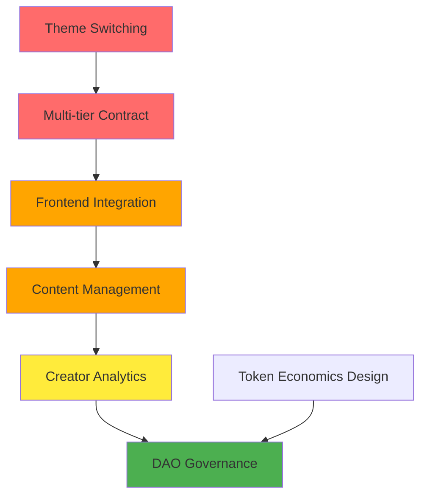

# DotNation: Creator Economy Transition - Urgency-Based Analysis

**Date:** November 24, 2025  
**Status:** Transition from Pure Crowdfunding → Full Creator Economy Platform  
**Current Phase:** Gap Analysis & Implementation Planning

---

## Executive Summary

DotNation has a **solid crowdfunding foundation** (Phases 1-2 complete) but needs strategic additions to become a **full creator economy platform** (decentralized Patreon alternative). This document prioritizes implementation by urgency, impact, and dependencies.

**Key Insight:** We have strong infrastructure (theme system, routing, subscription contract basics) but need focused enhancements to unlock creator economy features.

---

## Urgency Matrix

### 🔴 **CRITICAL - DO FIRST** (Blocking Other Work)

#### 1. Automatic Theme Switching System
**Urgency Level:** 🔴 CRITICAL  
**Impact:** High (UX consistency)  
**Effort:** Low (2-3 hours)  
**Dependencies:** None  
**Blocks:** User perception of platform identity

**Why Critical:**
- Currently **confusing UX**: Users manually see dark theme on creator pages if they came from crowdfunding
- **Brand identity**: Crowdfunding (dark) vs Creator Economy (light) needs visual separation
- **Quick win**: Infrastructure exists, just needs route-based automation
- **Foundation for marketing**: "Two platforms in one" messaging requires visual distinction

**Current State:**
- `ThemeContext.jsx` has `setLightTheme()` and `setDarkTheme()` functions
- `CreatorProfilePage.jsx` manually calls `setLightTheme()` (line 21)
- No centralized route-based theme logic

**Implementation Plan:**
```jsx
// Create: frontend/src/components/ThemeRouter.jsx
// - Wrap routes with theme detection
// - /campaigns/*, /create-campaign, /dashboard → dark
// - /members/*, /creator/* → light
// - Automatic theme switching on navigation
```

**Files to Modify:**
- `frontend/src/App.jsx` - Add ThemeRouter wrapper
- Create `frontend/src/components/ThemeRouter.jsx`
- Remove manual theme calls from individual pages

**Success Metrics:**
- [ ] Theme automatically switches when navigating between sections
- [ ] No manual `setLightTheme()` calls in page components
- [ ] Smooth theme transitions (no flash)

---

#### 2. Multi-Tier Subscription Contract Upgrade
**Urgency Level:** 🔴 CRITICAL  
**Impact:** Critical (Core creator economy feature)  
**Effort:** Medium (1 day)  
**Dependencies:** None  
**Blocks:** Content gating, tier selection UI, real subscriptions

**Why Critical:**
- **Current contract is single-tier** - Can't support Bronze/Silver/Gold model
- **UI already built** - `CreatorProfilePage` has mock tier data (lines 36-80)
- **Core feature**: Without tiers, it's just donations, not memberships
- **Blocks content gating**: Can't implement tier-based access control without on-chain tiers

**Current State:**
```rust
// subscription_manager/lib.rs current capabilities:
- ✅ Creator registration with single price
- ✅ 30-day subscriptions
- ✅ Fee splitting (3%)
- ❌ No tier support
- ❌ No benefits encoding
- ❌ No tier-based access control
```

**What's Missing:**
```rust
// Need to add to subscription_manager/lib.rs:

pub struct Tier {
    name: String,           // "Bronze", "Silver", "Gold"
    price: Balance,         // Monthly price in plancks
    benefits: Vec<String>,  // ["video_access", "discord_access", etc.]
    active: bool,           // Can be enabled/disabled
}

pub struct Subscription {
    creator: AccountId,
    subscriber: AccountId,
    tier_id: u32,           // Which tier they subscribed to
    expiration: Timestamp,
    auto_renew: bool,
}

// New functions needed:
- create_tier(name, price, benefits)
- update_tier_benefits(tier_id, new_benefits)
- subscribe_to_tier(creator, tier_id)  // Replace simple subscribe()
- get_subscriber_tier(user, creator) -> Option<u32>
- check_tier_access(user, creator, required_tier) -> bool
- get_creator_tiers(creator) -> Vec<Tier>
```

**Implementation Plan:**
1. **Phase A - Contract Enhancement** (4-6 hours)
   - Modify `subscription_manager/lib.rs` structure
   - Add tier storage and management
   - Update subscription logic to include tier_id
   - Add tier access validation functions
   - Write comprehensive tests

2. **Phase B - Deployment & ABI** (1 hour)
   - Deploy updated contract to testnet
   - Generate new ABI file
   - Place in `/frontend/src/contracts/subscription_manager.json`

3. **Phase C - Frontend Integration** (2-3 hours)
   - Update `MembershipContext.jsx` to use new contract
   - Connect tier selection UI to contract
   - Add tier validation in content components
   - Remove mock data dependencies

**Files to Create/Modify:**
- `subscription_manager/lib.rs` - Core contract upgrade
- `frontend/src/contracts/subscription_manager.json` - New ABI
- `frontend/src/contexts/MembershipContext.jsx` - Real integration
- `frontend/src/pages/CreatorProfilePage.jsx` - Connect to real tiers
- `frontend/src/config/constants.js` - Add subscription contract address

**Success Metrics:**
- [ ] Can create multiple tiers per creator on-chain
- [ ] Subscribers select specific tier when subscribing
- [ ] Tier access validation works on-chain
- [ ] UI reflects real on-chain tier data

---

### 🟠 **HIGH PRIORITY** (Major Features, Not Blocking)

#### 3. Frontend Subscription Integration (Real Data)
**Urgency Level:** 🟠 HIGH  
**Impact:** High (Removes mock data, enables real usage)  
**Effort:** Medium (6-8 hours)  
**Dependencies:** ✅ Multi-tier contract deployed  
**Blocks:** Real creator onboarding, revenue generation

**Why High Priority:**
- **Currently all mock data** in `MembershipContext.jsx`
- **Can't actually use subscriptions** without integration
- **Prerequisite for creators** to earn from memberships
- **Unlocks revenue model** - 3% fees from subscriptions

**Current State:**
```jsx
// frontend/src/contexts/MembershipContext.jsx
// Everything is mock data:
const mockSubscriptions = [...];
const mockTiers = [...];
const mockCreators = [...];
```

**Implementation Plan:**
1. Add subscription contract initialization
2. Replace all mock functions with contract calls
3. Add event listeners for subscription changes
4. Implement real-time subscription status checking
5. Handle loading/error states properly

**Files to Modify:**
- `frontend/src/contexts/MembershipContext.jsx` - Main integration
- `frontend/src/components/TierSelection.jsx` - Connect to contract
- `frontend/src/pages/CreatorProfilePage.jsx` - Use real data
- `frontend/src/pages/MembersDashboard.jsx` - Show real subscriptions

**Success Metrics:**
- [ ] No mock data in MembershipContext
- [ ] Real subscription transactions work end-to-end
- [ ] Subscription status updates in real-time
- [ ] Creators can see real subscriber counts

---

#### 4. Content Management System Architecture
**Urgency Level:** 🟠 HIGH  
**Impact:** Critical (Core creator value proposition)  
**Effort:** High (3-4 days for full implementation)  
**Dependencies:** ✅ Multi-tier contract, ✅ Subscription integration  
**Blocks:** Creator content posting, subscriber value delivery

**Why High Priority:**
- **Core value proposition** for creators: "Post content for subscribers"
- **Currently no way to post/store content** - only mock posts
- **Differentiates from crowdfunding** - this IS the creator economy
- **Subscriber retention**: Without content, subscriptions have no value

**Current State:**
- Mock posts in `CreatorProfilePage` (lines 81-120+)
- No storage mechanism
- No content creation UI
- No access control system

**Design Decisions Needed:**
1. **Storage Strategy:**
   - Option A: IPFS (decentralized, immutable, higher cost)
   - Option B: Traditional storage (cheaper, centralized)
   - Option C: Hybrid (metadata on-chain, content off-chain)
   - **Recommendation:** Hybrid - IPFS hash + metadata on-chain

2. **Content Types:**
   - Text posts/articles (markdown)
   - Video embeds (YouTube/Vimeo links or IPFS)
   - Downloads (PDFs, code, etc.)
   - Live streams (future)

3. **Access Control:**
   - Per-post tier requirements
   - Time-based access (early access periods)
   - Purchase options (one-time access without subscription)

**Proposed Architecture:**
```rust
// New contract: content_manager/lib.rs

pub struct Content {
    id: u32,
    creator: AccountId,
    content_type: ContentType,  // Article, Video, Download
    ipfs_hash: String,          // Content location
    title: String,
    description: String,
    required_tier: u32,         // Minimum tier for access
    created_at: Timestamp,
    likes: u32,
    views: u32,
}

pub enum ContentType {
    Article,
    Video,
    Download,
    LiveStream,
}

// Key functions:
- create_content(ipfs_hash, title, required_tier)
- update_content(content_id, new_ipfs_hash)
- check_content_access(user, content_id) -> bool
- get_creator_content(creator, offset, limit) -> Vec<Content>
- like_content(content_id)
- record_view(content_id)
```

**Implementation Plan:**

**Phase A - Architecture & Design** (4 hours)
- Design data structures
- Choose storage strategy
- Define access control logic
- Plan IPFS integration

**Phase B - Smart Contract** (1 day)
- Implement content_manager contract
- Add access validation
- Integrate with subscription_manager
- Write tests

**Phase C - Backend IPFS Integration** (4-6 hours)
- Add IPFS upload endpoint to gemini-backend
- Handle file uploads
- Return IPFS hashes to frontend
- Add content moderation hooks

**Phase D - Frontend Content Creation** (1 day)
- Build content creation form for creators
- Add IPFS upload UI
- Implement rich text editor (markdown)
- Add media embeds

**Phase E - Content Feed & Access** (6-8 hours)
- Build content feed component
- Add tier-based access gates
- Implement "unlock" UI for non-subscribers
- Add like/view tracking

**Files to Create:**
- `content_manager/lib.rs` - New contract
- `content_manager/Cargo.toml` - Contract config
- `gemini-backend/ipfsUpload.js` - IPFS integration
- `frontend/src/components/ContentCreator.jsx` - Creation UI
- `frontend/src/components/ContentFeed.jsx` - Display component
- `frontend/src/components/ContentAccessGate.jsx` - Tier checking
- `frontend/src/contexts/ContentContext.jsx` - Content state management

**Success Metrics:**
- [ ] Creators can post content with tier requirements
- [ ] Content stored on IPFS with hash on-chain
- [ ] Subscribers can access tier-appropriate content
- [ ] Non-subscribers see locked content with upgrade prompt
- [ ] View and like counts update

---

### 🟡 **MEDIUM PRIORITY** (Important but Not Urgent)

#### 5. DAO Governance Architecture
**Urgency Level:** 🟡 MEDIUM  
**Impact:** High (Long-term platform sustainability)  
**Effort:** High (2-3 days design + 1 week implementation)  
**Dependencies:** Token economics design  
**Blocks:** Community ownership, decentralized decision-making

**Why Medium Priority:**
- **Not immediately user-facing** - platform works without it
- **Strategic long-term value** - mentioned in whitepaper
- **Complex design decisions** - needs careful planning
- **Can launch creator economy first** - add governance later

**Current State:**
- DAO milestone voting exists for campaigns (donation-weighted)
- No platform-level governance
- No Nation Token (NTN) implementation
- 3% fees collected but no governance over treasury

**Design Questions to Answer:**

1. **Governance Scope:**
   - Single DAO for both crowdfunding AND creator economy?
   - Separate DAOs (CrowdfundingDAO + CreatorDAO)?
   - **Recommendation:** Single unified DAO - simpler, more cohesive

2. **Voting Weight:**
   - Token-based (NTN holders vote)?
   - Stake-based (total donations + subscriptions)?
   - Hybrid (NTN + activity weight)?
   - **Recommendation:** Hybrid - prevents whale dominance, rewards participation

3. **Proposal Types:**
   - Platform fee changes
   - Feature prioritization
   - Treasury allocation (grants, development)
   - Contract upgrades
   - Creator verification/disputes

4. **Treasury Management:**
   - How are 3% fees governed?
   - Grant programs for creators?
   - Development funding?
   - Community rewards?

**Proposed Architecture:**
```rust
// New contract: platform_dao/lib.rs

pub struct Proposal {
    id: u32,
    proposer: AccountId,
    proposal_type: ProposalType,
    title: String,
    description: String,
    voting_ends: Timestamp,
    votes_for: Balance,      // Weighted votes
    votes_against: Balance,
    executed: bool,
    threshold: u32,          // Basis points (6600 = 66%)
}

pub enum ProposalType {
    FeeChange(u32),                    // Change platform fee
    TreasuryAllocation(AccountId, Balance),  // Grant/payment
    ContractUpgrade(AccountId),        // New logic contract
    FeaturePriority(String),           // Vote on roadmap
}

pub struct VotingPower {
    ntn_tokens: Balance,              // Token holdings
    donation_volume: Balance,         // Total donated
    subscription_volume: Balance,     // Total subscriptions paid
    reputation_score: u32,            // Based on activity
}

// Key functions:
- create_proposal(proposal_type, description, threshold)
- vote_on_proposal(proposal_id, approve: bool)
- execute_proposal(proposal_id)
- calculate_voting_power(account) -> VotingPower
- delegate_votes(to: AccountId, amount: Balance)
```

**Implementation Plan:**

**Phase A - Token Economics Design** (1 day)
- Define NTN token supply and distribution
- Design utility (governance, staking, boosting)
- Plan vesting schedules
- Create tokenomics document

**Phase B - DAO Contract** (2-3 days)
- Implement proposal system
- Add weighted voting logic
- Create execution mechanisms
- Add delegation features
- Write comprehensive tests

**Phase C - Frontend Governance UI** (2 days)
- Build proposal creation form
- Add proposal browsing/voting interface
- Show voting power calculation
- Add treasury dashboard
- Implement delegation UI

**Files to Create:**
- `TOKENOMICS.md` - Token economics whitepaper
- `platform_dao/lib.rs` - DAO contract
- `ntn_token/lib.rs` - Token contract (PSP22 standard)
- `frontend/src/pages/GovernancePage.jsx` - Main governance UI
- `frontend/src/components/ProposalCard.jsx` - Proposal display
- `frontend/src/components/VotingInterface.jsx` - Voting UI
- `frontend/src/contexts/GovernanceContext.jsx` - DAO state

**Success Metrics:**
- [ ] Token deployed with proper distribution
- [ ] DAO can create and vote on proposals
- [ ] Voting power correctly calculated (hybrid model)
- [ ] Successful proposals can be executed
- [ ] Treasury governed by DAO decisions

---

#### 6. Creator Analytics Dashboard
**Urgency Level:** 🟡 MEDIUM  
**Impact:** Medium (Creator experience enhancement)  
**Effort:** Medium (2 days)  
**Dependencies:** ✅ Real subscriptions, ✅ Content system  
**Blocks:** Creator insights, optimization

**Why Medium Priority:**
- **Enhances creator experience** but not required for launch
- **Competitive feature** - Patreon has detailed analytics
- **Helps creators optimize** content strategy
- **Easy to add incrementally** after core features work

**Current State:**
- `CreatorDashboard.jsx` exists with mock data
- No real metrics collection
- No subscriber analytics

**What's Needed:**
```jsx
// Analytics to track:
- Total revenue (all-time, monthly)
- Subscriber count by tier
- Subscriber growth over time
- Content performance (views, likes per post)
- Subscription churn rate
- Revenue projections
- Top-performing content
- Audience demographics (future)
```

**Implementation Plan:**
1. Add analytics functions to contracts (getters)
2. Create analytics aggregation in backend
3. Build charts and visualizations
4. Add export functionality (CSV, PDF)

**Files to Modify:**
- `frontend/src/pages/CreatorDashboard.jsx` - Real data
- Add `frontend/src/components/AnalyticsChart.jsx`
- Add analytics endpoints in contracts

---

### 🟢 **LOW PRIORITY** (Nice-to-Have, Future Enhancements)

#### 7. Recurring Payment Automation
**Urgency Level:** 🟢 LOW  
**Impact:** Medium (UX improvement)  
**Effort:** High (Complex, requires wallet integration)  
**Dependencies:** Payment infrastructure  

**Why Low Priority:**
- **Manual renewal works fine** for MVP
- **Complex technical challenge** - requires recurring transaction signing
- **UX workarounds exist** - email reminders, in-app notifications
- **Can add later** without breaking existing subscriptions

**Options:**
- Option A: Manual renewal (current - simple, reliable)
- Option B: Wallet pre-authorization (complex, better UX)
- Option C: Subscription NFTs with transfer logic (experimental)

---

#### 8. Cross-Chain Support
**Urgency Level:** 🟢 LOW  
**Impact:** High (Market expansion)  
**Effort:** Very High (1-2 weeks)  
**Dependencies:** XCM knowledge, multi-chain infrastructure  

**Why Low Priority:**
- **Polkadot ecosystem is sufficient** for launch
- **Adds complexity** before proving core product
- **Better after product-market fit** - expand from strength

---

#### 9. Mobile App
**Urgency Level:** 🟢 LOW  
**Impact:** Medium (Additional platform)  
**Effort:** Very High (2-3 weeks)  
**Dependencies:** Web platform stable  

**Why Low Priority:**
- **Web-first strategy** works for initial launch
- **Responsive design** covers mobile web users
- **Native app** is marketing/convenience, not necessity
- **Build after web platform proven**

---

## Recommended Implementation Order

### 🚀 **Sprint 1: Visual Identity & Core Infrastructure** (Week 1)
1. **Day 1-2:** Automatic theme switching system
2. **Day 3-5:** Multi-tier subscription contract upgrade
3. **Day 6-7:** Frontend subscription integration (real data)

**Outcome:** Platform visually distinct, subscriptions fully functional

---

### 🚀 **Sprint 2: Content Management MVP** (Week 2)
1. **Day 1-2:** Content management architecture design
2. **Day 3-5:** Content manager contract + IPFS integration
3. **Day 6-7:** Content creation UI for creators

**Outcome:** Creators can post tier-gated content

---

### 🚀 **Sprint 3: Content Consumption & Polish** (Week 3)
1. **Day 1-3:** Content feed and access gates
2. **Day 4-5:** Creator analytics dashboard
3. **Day 6-7:** Testing, bug fixes, polish

**Outcome:** Full creator economy loop working end-to-end

---

### 🚀 **Sprint 4: Governance & Long-term** (Week 4+)
1. **Week 4:** Token economics design + DAO architecture
2. **Week 5:** DAO contract implementation
3. **Week 6:** Governance UI + testing

**Outcome:** Platform governance decentralized

---

## Critical Path Dependencies



**Legend:**
- 🔴 Red = Critical (Do First)
- 🟠 Orange = High Priority
- 🟡 Yellow = Medium Priority
- 🟢 Green = Low Priority

---

## Risk Analysis

### High-Risk Items (Need Careful Attention)

1. **Multi-tier Contract Migration**
   - Risk: Breaking existing single-tier subscriptions
   - Mitigation: Deploy new contract, migrate carefully, maintain backwards compatibility

2. **Content Storage Costs**
   - Risk: IPFS storage can be expensive at scale
   - Mitigation: Implement content size limits, explore Filecoin/Arweave for long-term

3. **Governance Attack Vectors**
   - Risk: Whale dominance in voting
   - Mitigation: Hybrid voting weight, quadratic voting consideration

4. **Subscription Revenue Model**
   - Risk: 3% fee may not sustain platform long-term
   - Mitigation: DAO can adjust, explore premium features

### Technical Debt to Address

1. **MembershipContext mock data** - Needs removal (Sprint 1)
2. **Subscription contract ABI missing** - Add in Sprint 1
3. **Manual theme switching** - Automate in Sprint 1
4. **No content storage strategy** - Design in Sprint 2

---

## Success Criteria

### Phase 1 Complete (Creator Economy MVP) When:
- [ ] Theme automatically switches between crowdfunding/creator sections
- [ ] Creators can register with multiple tiers (Bronze/Silver/Gold)
- [ ] Users can subscribe to specific tiers
- [ ] Creators can post tier-gated content
- [ ] Subscribers can access content based on tier
- [ ] Basic creator analytics working
- [ ] 3% subscription fees collected and tracked

### Platform Fully Decentralized When:
- [ ] DAO governs platform decisions
- [ ] Token distributed to community
- [ ] Treasury managed by DAO proposals
- [ ] Contract upgrades require DAO approval
- [ ] Creator/subscriber disputes handled by governance

---

## Resource Requirements

### Development Time Estimates
- **Minimum Viable Creator Economy:** 3 weeks (Sprints 1-3)
- **Full Decentralized Platform:** 6 weeks (Sprints 1-4)

### Infrastructure Costs
- **IPFS Storage:** ~$50-200/month (depends on content volume)
- **Redis Backend:** Current Render deployment sufficient
- **Blockchain Fees:** Variable (testnet free, mainnet ~$0.10-1.00 per tx)

### Skills Needed
- ✅ Rust/ink! smart contract development
- ✅ React frontend development
- ✅ Polkadot.js integration
- ⚠️ IPFS integration (new)
- ⚠️ Token economics design (new)

---

## Next Immediate Actions

### To Start Sprint 1 Today:

1. **Confirm priority decisions:**
   - Approve Sprint 1 scope (theme + subscriptions)
   - Confirm IPFS as storage strategy for Sprint 2
   - Decide on DAO timing (Sprint 4 ok?)

2. **Technical setup:**
   - Branch off `creator-economy-sprint-1`
   - Set up local contract testing environment
   - Prepare testnet deployment wallet

3. **Begin implementation:**
   - Start with theme switching (quick win)
   - Design multi-tier contract structure
   - Plan subscription context refactor

---

## Questions for Decision

Before proceeding, please confirm:

1. **Start with Sprint 1?** (Theme switching + Multi-tier subscriptions)
2. **IPFS for content storage?** (Or prefer alternative?)
3. **DAO in Sprint 4?** (Or defer to post-launch?)
4. **Target launch date?** (Helps prioritize nice-to-haves)
5. **Accept 3% fee model?** (Or want to adjust?)

---

**Document Status:** ✅ Ready for Review  
**Next Update:** After Sprint 1 completion  
**Maintained By:** Development Team  
**Last Reviewed:** November 24, 2025
