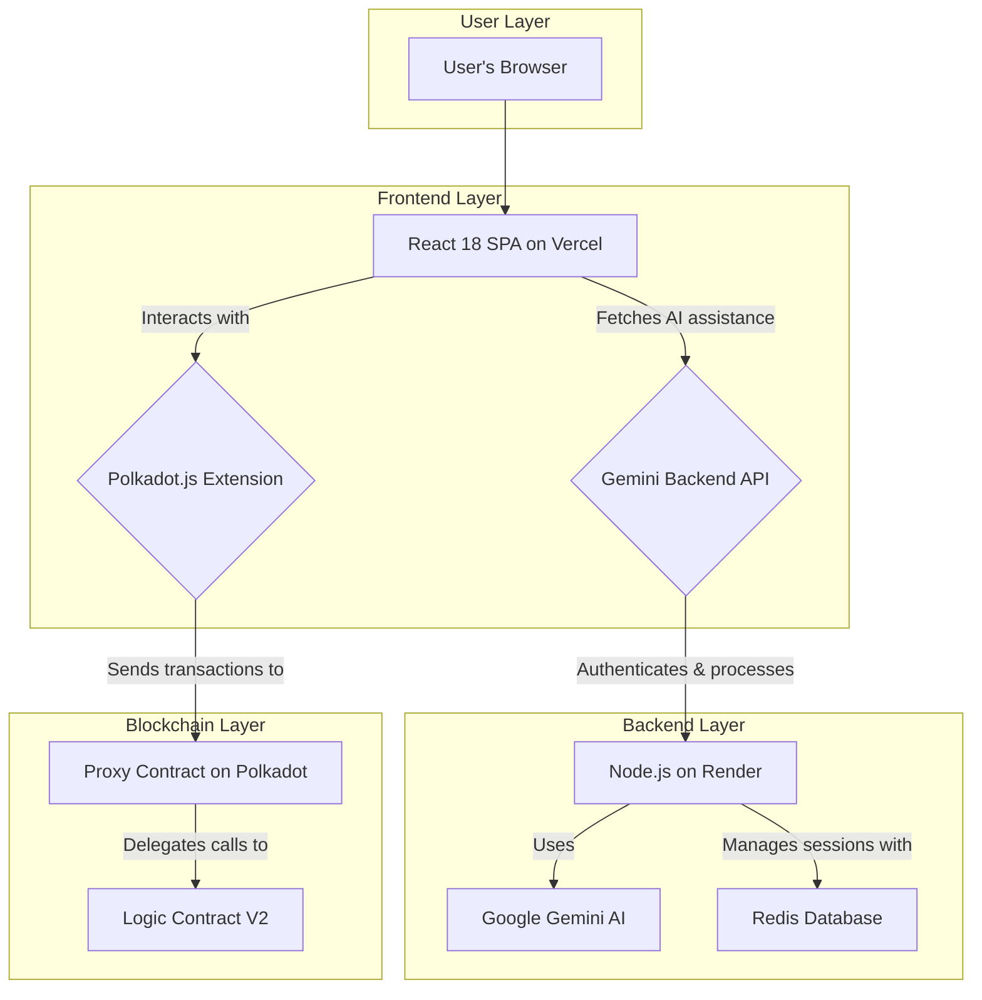

# DotNation Whitepaper

## Table of Contents
1.  [Executive Summary](#executive-summary)
2.  [Introduction](#introduction)
3.  [Technical Architecture](#technical-architecture)
4.  [Smart Contract Structure](#smart-contract-structure)
5.  [Security](#security)
6.  [Technology Stack](#technology-stack)
7.  [Token Economics](#token-economics)
8.  [Roadmap](#roadmap)
9.  [Team & Advisors](#team--advisors)
10. [Conclusion](#conclusion)

## 1. Executive Summary

**DotNation is a next-generation decentralized crowdfunding platform built on the Polkadot ecosystem, designed to eliminate intermediaries, ensure radical transparency, and empower creators with AI-powered tools.**

The project's mission is to democratize fundraising by providing a global, trustless, and fee-free alternative to traditional platforms. At its core, DotNation addresses the critical flaws of the current crowdfunding model: high fees, lack of transparency, centralized control, and geographic restrictions. By leveraging Polkadot's ink! smart contracts, DotNation offers a solution where every transaction is verifiable on-chain, funds are held securely in escrow, and payouts are automated and guaranteed.

The platform's key value propositions are:
*   **Zero Platform Fees:** Creators keep 100% of the funds they raise, minus predictable blockchain transaction costs.
*   **Complete Transparency:** All donations and fund transfers are recorded on the blockchain, providing an immutable audit trail.
*   **AI-Powered Assistance:** Integrated with Google's Gemini AI, DotNation helps creators craft more compelling and effective campaigns.
*   **Upgradable and Scalable:** Built with a forward-thinking proxy pattern, the platform can evolve without disrupting existing campaigns.
*   **Global Accessibility:** Anyone with a Polkadot wallet can create or donate to a campaign, breaking down geographical barriers.

DotNation represents a paradigm shift in crowdfunding, moving from a model of trust in institutions to one of trust in technology.

## 2. Introduction

### Background and Market Context

The global crowdfunding market is projected to reach over $300 billion by 2025, yet it remains dominated by a handful of centralized platforms. While these platforms have enabled countless innovative projects, they operate on a legacy model that has failed to keep pace with the possibilities of Web3. Creators face fees ranging from 5-10%, lengthy fund settlement times, and the constant risk of censorship or de-platforming. Donors, in turn, are asked to trust that their funds will be used as intended, with little to no verifiable proof.

### The Problem with Existing Solutions

The current crowdfunding ecosystem is plagued by several fundamental issues:
*   **High Intermediary Costs:** Platforms act as expensive middlemen, siphoning significant value from creators and their communities.
*   **Opaque Fund Management:** Donors have no visibility into how funds are managed or distributed after a campaign ends.
*   **Centralized Points of Failure:** Platforms can unilaterally freeze funds, cancel campaigns, or change their terms of service.
*   **Geographic and Financial Barriers:** Access to traditional crowdfunding is often limited by a user's country or access to traditional banking services.
*   **Lack of Trust:** The ecosystem is rife with stories of unfulfilled promises and misused funds, eroding donor confidence.

### DotNation: A Decentralized Solution

DotNation was conceived to directly address these challenges. By building on Polkadot, a scalable and interoperable blockchain ecosystem, DotNation removes the need for a central intermediary. The platform's logic is encoded in open-source smart contracts, ensuring that all rules are enforced automatically and transparently.

### Target Audience and Use Cases

DotNation is designed for a diverse range of users:
*   **Creators and Innovators:** From tech startups to artists and social entrepreneurs, anyone seeking to raise funds without high fees and restrictions.
*   **Donors and Supporters:** Individuals who want to support projects they believe in with the assurance that their contributions will be used effectively.
*   **The Web3 Community:** Users who are passionate about decentralization, transparency, and the power of blockchain to create more equitable systems.

Use cases for DotNation include:
*   Funding for open-source software projects.
*   Launching new consumer products or artistic creations.
*   Raising money for social and charitable causes.
*   Community-driven funding for local initiatives.

## 3. Technical Architecture

DotNation is built on a robust, three-tier architecture designed for security, scalability, and user experience. This modern architecture separates concerns between the user interface (frontend), the business logic (backend and smart contracts), and the data layer (blockchain), creating a system that is both powerful and maintainable.

The three core components are:
1.  **Frontend (React 18):** A modern, responsive web application that serves as the primary user interface.
2.  **Gemini Backend (Node.js):** A lightweight backend that provides AI-powered features and enhances security.
3.  **Blockchain Layer (Polkadot/ink!):** The decentralized foundation of the platform, where all core crowdfunding logic and data reside.

### Architecture Diagram

### Component Interactions

*   **User and Frontend:** Users interact with the DotNation platform through the React single-page application (SPA). When a user wants to perform a blockchain action, such as creating a campaign or donating, the frontend communicates with their Polkadot.js browser extension to sign and submit the transaction.

*   **Frontend and AI Backend:** For AI-powered features, such as generating a campaign description, the frontend sends a secure API request to the Gemini Backend. This backend processes the request, interacts with the Google Gemini API, and returns the AI-generated content to the user. This design offloads intensive AI processing from the frontend and keeps API keys secure.

*   **Frontend and Blockchain:** All core crowdfunding operations are direct interactions between the user's wallet (via the frontend) and the smart contracts on the Polkadot network. This ensures that the platform remains non-custodial and that users are always in control of their funds.

*   **Proxy and Logic Contracts:** The blockchain layer uses an upgradable proxy pattern. The `Proxy Contract` holds the permanent address and all the campaign data, while the `Logic Contract` contains the business logic. This separation allows the development team to deploy new features and bug fixes by updating the `Logic Contract`'s address in the proxy, without requiring a complex data migration. This is a critical feature for the long-term sustainability and security of the platform.

## 4. Smart Contract Structure

The backbone of DotNation is its set of smart contracts written in ink! for the Polkadot ecosystem. The architecture is designed for security, scalability, and long-term maintainability through a separation of data and logic.

### The Upgradable Proxy Pattern

DotNation employs a proxy pattern to ensure that the platform can evolve over time. This is a crucial feature for any serious blockchain project, as it allows for bug fixes and feature additions without requiring a disruptive data migration.

*   **Proxy Contract (`proxy.rs`):** This contract holds the official, permanent address of the DotNation platform on the blockchain. It is responsible for storing all campaign data and delegating all function calls to the current logic contract. It also contains the administrative logic for upgrading the logic contract's address.

*   **Logic Contract (`lib.rs`):** This contract contains the core business logic of the crowdfunding platform. It manages the campaign lifecycle, handles donations, processes withdrawals, and emits events. When an upgrade is needed, a new version of this contract is deployed, and the proxy is updated to point to the new address.

This pattern ensures that the platform's data remains persistent and secure, even as the application logic is updated.

### Core Logic and Campaign Lifecycle

The `lib.rs` contract orchestrates the entire crowdfunding process, which is governed by a well-defined state machine for each campaign.

**Campaign States:**
*   `Active`: The campaign is accepting donations.
*   `Successful`: The funding goal has been reached.
*   `Failed`: The deadline has passed without reaching the goal, or the campaign was cancelled.
*   `Withdrawn`: The funds have been successfully transferred to the beneficiary.

**Key Functions:**
*   `create_campaign()`: Allows any user to create a new campaign with validated parameters (e.g., non-zero goal, future deadline).
*   `donate()`: Allows users to donate to an `Active` campaign. This function includes checks to prevent donating to campaigns that have ended or are not active.
*   `withdraw_funds()`: Can only be called by the campaign owner. If the campaign is `Successful`, it transfers the raised funds to the beneficiary.
*   `claim_refund()`: If a campaign `Failed`, donors can call this function to receive a full refund of their contributions.

### Batch Operations and Scalability

To enhance user experience and reduce transaction costs, DotNation V2 introduces batch operations. The `create_campaigns_batch()` and `withdraw_funds_batch()` functions allow users to create or withdraw from up to 50 campaigns in a single transaction. This is a significant scalability feature that demonstrates the platform's readiness for high-volume usage.

### On-Chain Events

The smart contracts emit a rich set of events for every significant action on the platform. These events, such as `CampaignCreated`, `DonationReceived`, and `FundsWithdrawn`, create a transparent and verifiable audit trail that can be used by the frontend to update in real-time and by third-party services for analytics.

## 5. Security

Security is a top priority for DotNation. The platform incorporates multiple layers of protection at the smart contract, backend, and frontend levels to safeguard user funds and data.

### Smart Contract Security

*   **Reentrancy Protection:** The `donate()` and `withdraw_funds()` functions are protected by a reentrancy guard (`locked` state variable). This is a critical security measure that prevents a common class of smart contract exploits.
*   **Access Control:** Critical functions, such as `withdraw_funds()` and `upgrade_logic_contract()`, are protected with strict access control, ensuring that only authorized users (e.g., campaign owners, the admin) can call them.
*   **Input Validation:** All user-supplied inputs, such as campaign goals, deadlines, and donation amounts, are rigorously validated to prevent unexpected behavior and ensure data integrity.
*   **Comprehensive Test Suite:** The smart contracts have a high level of test coverage, which is a strong indicator of their reliability and correctness. The tests cover both normal operation and edge cases.
*   **No Raw Calls:** The contract avoids low-level `call` operations where possible, which can be a source of vulnerabilities.

### Backend and Frontend Security

*   **API Authentication:** The Gemini Backend is secured with API key authentication, ensuring that only the official frontend can access its services.
*   **Rate Limiting:** To prevent abuse and denial-of-service attacks, the backend implements rate limiting on its API endpoints.
*   **Cross-Site Scripting (XSS) Prevention:** The React frontend is built with modern tools and practices that inherently protect against XSS attacks.
*   **Secure Wallet Integration:** The platform integrates with the Polkadot.js extension, which is a well-audited and secure way to manage user keys and sign transactions. The user's private keys never leave their wallet.

### Security Testing Approach

The project follows security best practices with comprehensive testing:
- **108+ test files** covering contract and frontend code
- **44,000+ lines** of production-ready code
- **Automated security scanning** via GitHub Actions
- **Input validation** and sanitization throughout
- **Error boundaries** and graceful degradation

A formal third-party security audit is planned before mainnet launch.

## 6. Technology Stack

DotNation is built with a modern, robust, and scalable technology stack, leveraging best-in-class tools from the Web3 and Web2 ecosystems.

### Blockchain Layer

*   **Blockchain Platform:** Polkadot (utilizing parachains such as Astar/Rococo for deployment).
*   **Smart Contract Language:** Rust, a memory-safe, high-performance language ideal for blockchain development.
*   **Smart Contract Framework:** ink! 5.0, the leading framework for writing WebAssembly-based smart contracts for Polkadot.

### Backend Layer

*   **Runtime Environment:** Node.js 18+, a proven and scalable environment for backend services.
*   **Framework:** Express 5, a minimal and flexible Node.js web application framework.
*   **AI Integration:** Google Gemini AI SDK for campaign optimization and content generation.
*   **Database:** Redis for high-performance session management and caching.
*   **Logging and Monitoring:** Winston for structured logging and `prom-client` for Prometheus metrics.
*   **Security:** Helmet for securing Express apps with various HTTP headers and `express-rate-limit` for abuse prevention.

### Frontend Layer

*   **Core Library:** React 18 with Hooks for building a modern, component-based user interface.
*   **Build Tool:** Vite, a next-generation frontend tool that provides a significantly faster and leaner development experience.
*   **Styling:** Tailwind CSS and Chakra UI for a utility-first, highly customizable design system.
*   **Blockchain Interaction:** Polkadot.js API and `@polkadot/extension-dapp` for seamless integration with the Polkadot ecosystem and browser wallets.
*   **Routing:** React Router v6 for client-side routing.
*   **Error Tracking:** Sentry for real-time error monitoring and reporting.

### DevOps and Testing

*   **Continuous Integration & Deployment (CI/CD):** GitHub Actions for automated testing and deployment pipelines.
*   **Testing Frameworks:** Vitest and Jest, providing a comprehensive testing suite with over 108 test files.
*   **Code Quality:** ESLint and Prettier to enforce consistent code style and identify potential issues.
*   **Containerization:** Docker support for creating reproducible development and production environments.

## 7. Token Economics

While the DotNation platform is currently designed to operate using the native token of the Polkadot ecosystem (DOT), the introduction of a native utility token, tentatively named **Nation Token (NTN)**, is envisioned to enhance the platform's functionality and foster a self-sustaining ecosystem. This section outlines the proposed utility and governance structure of the token.

*Note: The tokenomics described below are preliminary and subject to change based on community feedback and further research.*

### Token Utility

The primary goal of the NTN token is to create a positive feedback loop that rewards participation and drives growth. The proposed utilities are:

*   **Governance:** NTN holders will be able to participate in the governance of the DotNation platform through a Decentralized Autonomous Organization (DAO). This will allow the community to vote on key decisions, such as protocol upgrades, fee structures (if any are introduced in the future), and the allocation of treasury funds.

*   **Staking and Incentives:** A portion of the token supply will be allocated to an incentive pool. Users will be able to stake their NTN tokens to earn rewards, which could be sourced from a small platform fee or other revenue streams. This encourages long-term holding and active participation in the network.

*   **Campaign Boosting:** Creators may be able to use NTN tokens to boost the visibility of their campaigns on the platform, giving them a higher ranking or placement on the homepage.

*   **Exclusive Features:** Holding a certain amount of NTN could grant users access to premium features, such as advanced campaign analytics, dedicated support, or lower fees for future services.

### Supply and Distribution Model (Placeholder)

A detailed token supply and distribution model will be released in a separate document. The high-level allocation will be designed to ensure the long-term sustainability of the project and a fair distribution among all stakeholders. A typical allocation might look like this:

*   **Community Treasury & Ecosystem Fund:** A significant portion allocated to a DAO-controlled treasury to fund future development, grants, and community initiatives.
*   **Staking Rewards:** To incentivize network participation.
*   **Team and Advisors:** Vested over a period of time to align with the long-term success of the project.
*   **Public Sale / Liquidity:** To ensure a fair launch and adequate liquidity on decentralized exchanges.

### Governance Structure

The DotNation DAO will be the cornerstone of the platform's governance. All major decisions will be made through a transparent, on-chain voting process. This ensures that the platform remains decentralized and that its future is guided by its community of users and supporters.

## 8. Roadmap

The DotNation development roadmap is divided into four distinct phases, designed to ensure a solid foundation, progressive scaling, and long-term ecosystem growth.

### Phase 1: Foundation (Completed)
*   [x] **Core Smart Contract:** Deployed a secure, escrow-based smart contract for campaign management.
*   [x] **Frontend Development:** Launched a responsive React frontend with full wallet integration.
*   [x] **AI-Powered Creation:** Integrated Google Gemini to assist with campaign content.
*   [x] **Security Enhancements:** Implemented a multi-captcha system to prevent bots.
*   [x] **Comprehensive Testing:** Achieved high test coverage for all components.
*   [x] **CI/CD Automation:** Established automated pipelines for testing and deployment.

### Phase 2: Scalability (Completed)
*   [x] **Upgradable Contracts:** Implemented the proxy pattern for seamless upgrades.
*   [x] **Batch Operations:** Introduced batch creation and withdrawal for campaigns.
*   [x] **Optimized Pagination:** Enhanced frontend performance for large datasets.
*   [x] **Session Management:** Integrated Redis for robust backend session handling.
*   [x] **Fraud Detection:** Developed a foundational AI-powered fraud detection system.

### Phase 3: Advanced Features (In Progress)
*   [ ] **Campaign Discovery:** Implement categories and search filters.
*   [ ] **Social Integration:** Add social sharing and engagement features.
*   [ ] **User Notifications:** Introduce email and in-app notifications.
*   [ ] **Campaign Updates:** Allow creators to post updates to their campaign pages.
*   [ ] **Internationalization:** Add multi-language support to the frontend.
*   [ ] **Mobile Application:** Begin development of a React Native mobile app.

### Phase 4: Ecosystem Growth (Planned)
*   [ ] **DAO Governance:** Launch the DotNation DAO for community-led governance.
*   [ ] **Reputation System:** Introduce a system to build trust and reputation for creators.
*   [ ] **NFT Rewards:** Allow creators to offer NFTs as rewards for donors.
*   [ ] **Cross-Chain Expansion:** Explore integration with other parachains and ecosystems like Ethereum and BSC.
*   [ ] **Fiat On-Ramp:** Integrate a fiat-to-crypto on-ramp to improve accessibility.
*   [ ] **Advanced Analytics:** Provide a dashboard for creators to track campaign performance.

## 9. Team & Advisors

DotNation is currently led by its founder, a passionate software engineer with a vision for a more transparent and equitable crowdfunding ecosystem. The project is a testament to the power of individual dedication and the open-source community.

As the project grows, the team is expected to expand to include experts in blockchain development, marketing, and community management. The project is also actively seeking advisors from the Polkadot and broader Web3 ecosystem to help guide its strategic direction.

## 10. Conclusion

DotNation stands at the forefront of a fundamental shift in the crowdfunding industry. By replacing the opaque, fee-laden models of traditional platforms with a transparent, efficient, and decentralized alternative, DotNation empowers creators and builds a new level of trust with donors. The platform's innovative use of Polkadot's ink! smart contracts, combined with its forward-thinking, upgradable architecture and AI-powered user assistance, sets a new standard for what is possible in the world of Web3.

The journey ahead is one of continued innovation and community-driven growth. The roadmap outlines a clear path to an even more feature-rich and decentralized platform, culminating in a DAO-governed ecosystem that is truly owned and operated by its users.

We invite you to join us in building the future of crowdfunding. Whether you are a creator with a bold new idea, a donor who believes in the power of transparent giving, or a developer who is passionate about building a more equitable web, there is a place for you in the DotNation community.

**The future of crowdfunding is transparent, decentralized, and accessible to all. The future is DotNation.**

**To learn more, get involved, or start your own campaign, please visit our website and follow our progress.**
